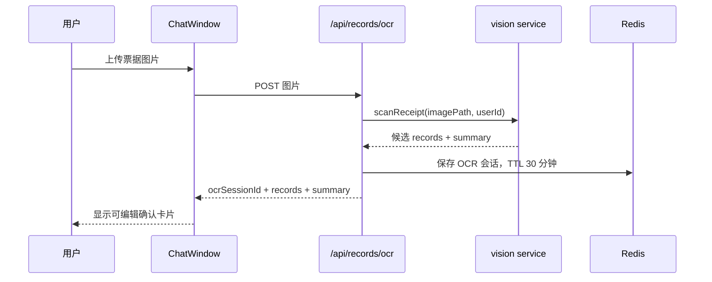
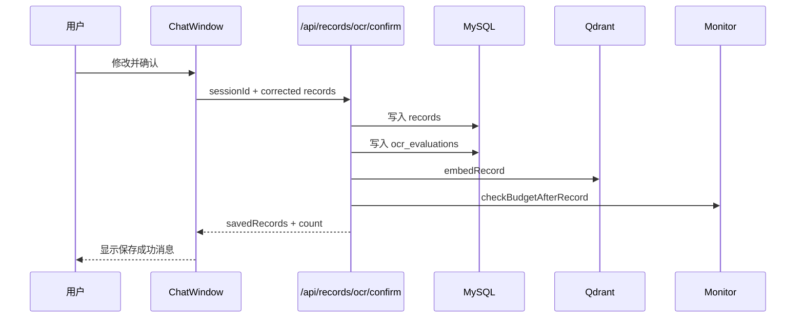

# Smart Finance V3 第二阶段：OCR 人工确认闭环设计

## 背景

第一阶段已经完成 MySQL 迁移、自然语言记账主链路、Redis Agent 任务流、Qdrant 向量记忆和预算监控。第二阶段聚焦一个单独目标：让票据/支付截图 OCR 不再直接写入账本，而是先进入用户可编辑的确认环节，用户确认后才生成正式记账记录。

当前代码现状：

- `client/src/components/ChatWindow.vue` 已有 OCR 结果编辑确认卡片，可复用。
- `client/src/utils/api.js` 里 `ocrImage(file)` 当前调用 `/api/vision`，而 `ocrReceipt(file)` 调用 `/api/records/ocr`。
- `server/src/routes/vision.js` 上传识别后只返回结果，但没有使用登录鉴权。
- `server/src/routes/records.js` 的 `/api/records/ocr` 使用鉴权，但会直接写入 `records`。
- `server/src/services/vision.js` 包含硬编码智谱 Key 和中文乱码，触碰 OCR 时需要一并修复。
- MySQL schema 已存在 `ocr_evaluations`，适合记录 OCR 原始结果、用户确认和修正情况。

## 目标

第二阶段完成后，用户上传票据/支付截图时：

1. 系统识别图片并返回候选记录，但不写入 `records`。
2. 前端展示现有确认卡片，让用户修改金额、分类、日期、商家、备注或删除某条候选记录。
3. 用户点击确认后，后端一次性写入正式记账记录。
4. 每条确认记录写入后，继续触发向量记忆和预算监控。
5. OCR 原始结果与用户修正结果写入 `ocr_evaluations`，为后续 OCR 质量评估提供数据。
6. OCR 接口统一走登录鉴权，避免匿名上传图片进入财务数据链路。

## 非目标

本阶段不做以下事项：

- 不新增独立 OCR 页面。
- 不做微信深链、公众号或小程序交互。
- 不做 OCR 历史审核后台。
- 不重构整个聊天 UI。
- 不修复所有项目中的中文乱码，只修 OCR 闭环直接涉及的乱码。
- 不引入复杂的异步 OCR 队列；本阶段仍采用请求内同步识别，确认时同步入库。

## 推荐架构

采用“Redis 临时会话 + MySQL 确认落库”的轻量闭环。

上传识别阶段：



确认入库阶段：



## 后端设计

### OCR 会话服务

新增一个小型服务模块，例如 `server/src/services/ocrSession.js`，负责：

- 生成 `ocrSessionId`。
- 将 OCR 原始结果保存到 Redis。
- 根据 `ocrSessionId` 和 `userId` 读取会话。
- 确认或取消后删除会话。
- 默认 TTL 为 30 分钟。

Redis key 形式：

```text
ocr:session:<userId>:<ocrSessionId>
```

保存内容：

```json
{
  "userId": 1,
  "image": {
    "path": "uploads/xxx",
    "mimeType": "image/png",
    "size": 12345
  },
  "summary": "识别到 2 条消费记录",
  "totalAmount": 88.5,
  "records": [
    {
      "type": "expense",
      "amount": 25,
      "category": "餐饮",
      "description": "午餐",
      "date": "2026-07-17",
      "merchant": "某某餐厅"
    }
  ],
  "createdAt": "2026-07-17T00:00:00.000Z"
}
```

### OCR 上传接口

调整 `POST /api/records/ocr`：

- 保持 `authMiddleware`。
- 上传图片后调用 `scanReceipt`。
- 不再写入 `records`。
- 如果识别到候选记录，创建 Redis 会话并返回 `ocrSessionId`。
- 如果没有候选记录，返回空 `records` 和 summary，不创建正式记录。

响应格式：

```json
{
  "success": true,
  "data": {
    "ocrSessionId": "uuid",
    "summary": "识别到 2 条消费记录",
    "totalAmount": 88.5,
    "records": [
      {
        "type": "expense",
        "amount": 25,
        "category": "餐饮",
        "description": "午餐",
        "date": "2026-07-17",
        "merchant": "某某餐厅"
      }
    ],
    "count": 2,
    "expiresInSeconds": 1800
  }
}
```

### OCR 确认接口

新增 `POST /api/records/ocr/confirm`：

请求体：

```json
{
  "ocrSessionId": "uuid",
  "records": [
    {
      "type": "expense",
      "amount": 25,
      "category": "餐饮",
      "description": "午餐",
      "date": "2026-07-17",
      "merchant": "某某餐厅"
    }
  ]
}
```

行为：

- 按 `userId + ocrSessionId` 从 Redis 读取会话。
- 会话不存在或过期时返回 404。
- 校验每条确认记录：
  - `amount` 必须为正数，且小于等于 100000。
  - `category` 必须为非空字符串。
  - `date` 必须是 `YYYY-MM-DD`。
  - `type` 仅允许 `expense` 或 `income`，OCR 默认使用 `expense`。
- 使用事务写入 `records` 和 `ocr_evaluations`。
- 入库成功后，对每条记录调用 `embedRecord` 和 `checkBudgetAfterRecord`。
- 删除 Redis 会话。
- 返回保存后的记录和数量。

修正判定：

- 如果确认记录的 `amount`、`category`、`date`、`merchant`、`description` 与对应原始 OCR 记录存在差异，则 `user_corrected = 1`。
- `corrected_amount` 和 `corrected_category` 记录用户最终确认值。
- `ocr_correct = 1` 表示用户未修改关键字段，`ocr_correct = 0` 表示用户修改了关键字段。

### OCR 取消接口

本阶段实现 `POST /api/records/ocr/cancel`。取消接口让前端状态和后端临时会话清理更明确，Redis TTL 只作为异常兜底。

```json
{
  "ocrSessionId": "uuid"
}
```

行为：

- 按 `userId + ocrSessionId` 删除 Redis 会话。
- 不写 `records`。
- 不写 `ocr_evaluations`。
- 返回 `{ success: true }`。

### `/api/vision` 处理

为减少重复链路和鉴权风险，本阶段推荐将前端切到 `/api/records/ocr`，并让 `/api/vision` 不再作为主入口。

`/api/vision` 可保留为兼容接口，但需要满足其中之一：

- 加上 `authMiddleware`，内部复用同一 OCR 服务；
- 或返回明确提示，引导使用 `/api/records/ocr`。

实施时优先选择“加鉴权并复用”，这样不会破坏旧调用。

### Vision 服务修复

调整 `server/src/services/vision.js`：

- 使用 `config.ai.zhipuApiKey` 或 `process.env.ZHIPU_API_KEY`，删除硬编码 Key。
- 修复 OCR prompt、错误消息、分类列表和 summary 文案中的中文乱码。
- 保留没有 Key 或调用失败时返回空记录的降级行为。
- 保持 `scanReceipt(imagePath, userId)` 的对外接口稳定。

## 前端设计

复用 `client/src/components/ChatWindow.vue` 的 OCR 确认卡片。

需要调整：

- 上传时调用 `api.ocrReceipt(file)` 或将 `api.ocrImage(file)` 改为调用 `/api/records/ocr`。
- 保存后端返回的 `ocrSessionId`。
- 点击确认时，不再循环调用 `api.createRecord`，改为一次调用 `api.confirmOcr(ocrSessionId, ocrRecords)`。
- 点击取消时调用 `api.cancelOcr(ocrSessionId)`；如果取消接口失败，前端仍清空本地卡片并依赖 Redis 自动过期。
- 成功后展示“已保存 N 条记录”的聊天消息。
- 会话过期时展示“识别结果已过期，请重新上传图片”。

`client/src/utils/api.js` 新增或调整方法：

- `ocrReceipt(file)`：`POST /api/records/ocr`
- `confirmOcr(ocrSessionId, records)`：`POST /api/records/ocr/confirm`
- `cancelOcr(ocrSessionId)`：`POST /api/records/ocr/cancel`

## 数据和状态边界

- OCR 上传阶段只产生 Redis 临时状态，不产生正式财务记录。
- 用户确认阶段才产生 MySQL `records`。
- `ocr_evaluations` 只记录用户确认过的 OCR 结果；取消或过期的会话不写入。
- Redis 会话必须绑定 `userId`，用户不能确认别人的 OCR 会话。
- 同一个会话确认成功后立即删除，重复确认返回 404 或“会话已失效”。
- 前端删除某条候选记录表示用户不确认该条，不写入 `records`。

## 错误处理

- 图片缺失：返回 400，提示“缺少图片”。
- 图片类型不支持：返回 400，提示支持格式。
- OCR 无结果：返回 200，`records: []`，前端显示 summary。
- OCR 第三方服务失败或未配置 Key：返回 200 空结果，保持“可降级为空结果”的用户体验。
- 上传、鉴权或请求格式异常：按对应 HTTP 错误返回 400、401 或 500。
- 会话过期：确认接口返回 404。
- 确认记录全部无效：返回 400。
- 部分记录无效：推荐整体拒绝，返回第一条错误原因，避免用户以为全部保存成功。
- 向量写入或预算监控失败：不回滚已保存记录，但记录日志；主响应仍返回保存成功。

## 测试策略

后端优先使用 Node 内置 test，按 TDD 添加测试：

- OCR 上传接口不再直接写入 `records`。
- OCR 上传成功时写入 Redis 会话并返回 `ocrSessionId`。
- OCR 确认接口从 Redis 读取会话并写入 `records`。
- OCR 确认接口写入 `ocr_evaluations`，并正确标记 `user_corrected`。
- 会话过期或不存在时确认返回 404。
- 确认成功后调用向量记忆和预算监控。
- `vision.js` 在没有 `ZHIPU_API_KEY` 时返回空结果，不抛出硬错误。

前端以构建验证为主：

- `npm run build` 必须通过。
- 手工或轻量接口验证：上传图片后显示确认卡片，确认后只产生一次批量保存请求。

集成验证：

- Docker 环境启动后，使用登录 token 调用 `/api/records/ocr` 和 `/api/records/ocr/confirm`。
- 确认 MySQL `records` 增加对应记录。
- 确认 MySQL `ocr_evaluations` 增加对应评估记录。
- 确认 Redis 会话在确认后被删除。

## 验收标准

- 用户上传 OCR 图片后，未点击确认前，`records` 表不会新增记录。
- 用户确认后，`records` 表新增确认后的记录，而不是原始未修正记录。
- 用户修改金额或分类后，`ocr_evaluations.user_corrected = 1`。
- 用户取消或会话过期后，不产生任何正式记账记录。
- OCR 入口使用登录鉴权。
- `server/src/services/vision.js` 不再包含硬编码第三方 API Key。
- 后端测试和前端构建通过。

## 实施顺序建议

1. 先写 OCR session 服务测试和实现。
2. 再改 `/api/records/ocr` 为“只识别不入库”。
3. 新增 `/api/records/ocr/confirm` 和 `/api/records/ocr/cancel`。
4. 修复 `vision.js` 配置和中文 prompt。
5. 调整前端 API 和 `ChatWindow.vue` 确认逻辑。
6. 运行后端测试、前端构建和 Docker 集成验证。
