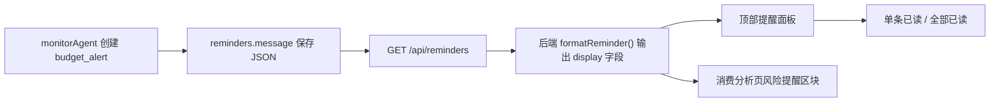

# Smart Finance V3 第三阶段：提醒中心增强与预算提醒可读化设计

## 背景

第一阶段完成了 MySQL、Redis、Qdrant 和自然语言记账主链路；第二阶段完成了 OCR 人工确认闭环。第三阶段聚焦一个更贴近用户感知的体验问题：后端已经能产生提醒，前端也已有铃铛入口，但预算提醒和系统提醒目前还不够“像给人看的财务建议”。

当前代码现状：

- `server/src/routes/reminders.js` 已提供待处理提醒列表、提醒数量、全部已读、单条已读和订阅授权接口。
- `server/src/services/monitorAgent.js` 会在预算达到 80% 或 100% 时创建 `budget_alert` 类型提醒。
- `reminders.message` 对预算提醒使用 JSON 字符串保存 `{ month, category, level, percent, budget, spent }`。
- `client/src/stores/app.js` 已有 `reminderCount`、`reminders`、`refreshReminders()`、`markAllRead()` 和 `toggleReminderPanel()`。
- `client/src/App.vue` 已有顶部铃铛和提醒面板，但目前直接展示 `title/message`，预算 JSON 不够可读，也不支持单条已读。
- `client/src/components/ReportPanel.vue` 已是消费分析页主入口，适合增加“本月风险提醒”小区块。
- `server/src/routes/observe.js` 目前只提供 agent/LLM 调用统计，暂不适合作为用户财务洞察展示。

## 目标

第三阶段完成后，用户能在不理解后台数据结构的情况下，直接看懂并处理预算提醒：

1. 提醒列表返回可展示的结构化字段，而不是让前端硬读 JSON 字符串。
2. 顶部提醒面板展示更清楚的预算提醒卡片，包括等级、分类、预算、已花、百分比和中文摘要。
3. 用户可以单条标记已读，也可以全部已读。
4. 消费分析页展示最近关键预算提醒，让用户不用打开铃铛也能看到风险。
5. 保留现有提醒铃铛、store 和路由结构，不新增大型页面。

## 非目标

本阶段不做以下事项：

- 不新增独立“洞察中心”页面。
- 不接入大模型生成复杂理财建议。
- 不做微信订阅消息完整闭环。
- 不修改预算生成逻辑，只增强已有提醒的可读化和处理体验。
- 不把 `/api/observe/stats` 做成用户界面；它仍保留为系统/开发观察数据。
- 不重构整个 `App.vue` 或全局布局。

## 推荐方案

采用“后端格式化提醒 + 前端轻量展示”的方式。



这个方案的优点：

- 不改数据库结构。
- 前端不用解析各种提醒 message 形态。
- 旧提醒可以继续兼容显示。
- 代码边界清楚，容易测试。

## 后端设计

### 提醒格式化服务

新增一个小型服务模块，例如 `server/src/services/reminderPresenter.js`，负责把数据库提醒行转换成前端展示模型。

输入：`reminders` 表中的一行。

输出示例：

```json
{
  "id": 12,
  "type": "budget_alert",
  "status": "pending",
  "title": "预算提醒：餐饮 已达到 warn",
  "message": "{\"month\":\"2026-07\",\"category\":\"餐饮\",\"level\":\"warn\",\"percent\":86,\"budget\":1000,\"spent\":860}",
  "created_at": "2026-07-18T10:00:00.000Z",
  "display": {
    "kind": "budget",
    "level": "warn",
    "levelText": "接近预算",
    "summary": "餐饮预算已使用 86%",
    "detail": "2026-07 餐饮预算 ¥1000，已花 ¥860。",
    "category": "餐饮",
    "month": "2026-07",
    "percent": 86,
    "budget": 1000,
    "spent": 860,
    "accent": "warning"
  }
}
```

### 格式化规则

预算提醒：

- `type === 'budget_alert'` 时尝试解析 `message` JSON。
- `level === 'critical'`：
  - `levelText = "已超预算"`
  - `accent = "danger"`
  - `summary = "<分类>预算已使用 <percent>%"`
- `level === 'warn'`：
  - `levelText = "接近预算"`
  - `accent = "warning"`
  - `summary = "<分类>预算已使用 <percent>%"`
- `category === 'total'` 时展示为“总预算”。
- 缺少字段时使用安全默认值，不抛出异常。

非预算提醒：

- `display.kind = "generic"`
- `display.level = "info"`
- `display.accent = "primary"`
- `display.summary = title`
- `display.detail = message`

### 提醒接口调整

调整 `GET /api/reminders`：

- 仍只返回当前用户 `pending` 状态提醒。
- 仍按 `created_at desc` 排序，默认最多 20 条。
- 每条提醒增加 `display` 字段。
- 支持可选 `limit` query，最大值 50。

确认并接入 `PUT /api/reminders/:id/read`：

- 当前接口已存在，本阶段需要前端接入。
- 成功后返回 `{ success: true }`。
- 只允许更新当前用户自己的提醒。

新增一个轻量接口：

`GET /api/reminders/highlights?limit=3`

该接口用于消费分析页展示重点提醒：

- 只返回当前用户待处理提醒。
- 优先级排序：
  1. `budget_alert` 且 `display.level = critical`
  2. `budget_alert` 且 `display.level = warn`
  3. 其它提醒按时间倒序
- 默认返回 3 条，最大 5 条。
- 复用同一个 `formatReminder()`。

## 前端设计

### 顶部提醒面板增强

保留当前铃铛入口和浮层位置，增强提醒项内容。

提醒项展示：

- 左侧状态色条或小圆点：
  - `danger`：红色
  - `warning`：橙色
  - `primary`：蓝色
- 主标题：`display.summary`
- 副标题：`display.detail`
- 标签：`display.levelText`
- 时间：`created_at`
- 操作：单条“已读”按钮

交互：

- 点击铃铛仍打开/关闭面板。
- 点击“全部已读”后清空列表并刷新数量。
- 点击单条“已读”后从当前列表移除，并刷新数量。
- 如果接口失败，不关闭面板，只在控制台记录错误；不弹复杂错误框。

### Store 增强

在 `client/src/stores/app.js` 中增加：

- `reminderHighlights: []`
- `refreshReminderHighlights(limit = 3)`
- `markReminderRead(id)`

现有：

- `refreshReminders()`
- `markAllRead()`
- `toggleReminderPanel()`

继续保留。

### API 增强

在 `client/src/utils/api.js` 中确认或新增：

- `getReminders(params = {})`
- `getReminderCount()`
- `markReminderRead(id)`
- `markAllRead()`
- `getReminderHighlights(limit = 3)`

注意：当前 `api.js` 工作区存在其它未提交扩展，实施时只提交本阶段直接相关 hunks，避免误带无关改动。

### 消费分析页风险提醒区块

在 `client/src/components/ReportPanel.vue` 中新增一个轻量区块，位置建议在概览卡和图表之间：

标题：`⚠️ 本月风险提醒`

展示逻辑：

- 有 highlights：展示最多 3 条提醒卡片。
- 无 highlights：展示“暂无预算风险，继续保持 ✨”。
- 每条提醒显示：
  - `display.summary`
  - `display.detail`
  - 单条“已读”按钮

刷新逻辑：

- `loadAll()` 同时加载 report、records、reminder highlights。
- 标记某条已读后，刷新 highlights 和顶部提醒数量。

## 数据和状态边界

- 数据库 `reminders.message` 保持原样，不做迁移。
- 可读化字段由后端即时计算，不持久化。
- `pending` 是唯一需要展示的提醒状态。
- `read` 状态提醒不在顶部面板和风险提醒区块展示。
- 后端所有提醒查询必须限定 `user_id = req.userId`。
- 前端不直接解析预算 JSON；只消费 `display` 字段。

## 错误处理

- `message` 不是 JSON：按普通提醒展示。
- JSON 缺字段：使用默认值展示，不影响接口返回。
- 单条已读失败：前端保留该提醒在列表中。
- highlights 接口失败：消费分析页显示空态，不阻塞报表加载。
- 提醒数量接口失败：保留当前数量，不影响主页面。

## 测试策略

后端使用 Node 内置 test，按 TDD 添加测试：

- `formatReminder()` 能把 `budget_alert` JSON 格式化为 `display` 字段。
- `formatReminder()` 能兼容非 JSON message。
- `GET /api/reminders` 返回带 `display` 的提醒。
- `GET /api/reminders/highlights` 按 critical、warn、时间排序并限制数量。
- `PUT /api/reminders/:id/read` 只更新当前用户提醒。

前端以构建验证为主：

- `npm run build` 必须通过。
- 手工或轻量 smoke：顶部面板能展示 `display.summary/detail`，单条已读后列表减少。

集成验证：

- Docker 环境中插入一条 `budget_alert` pending 提醒。
- 调用 `/api/reminders` 确认返回 `display.kind = budget`。
- 调用 `/api/reminders/highlights` 确认返回该提醒。
- 调用单条已读接口后，`/api/reminders/count` 减少。

## 验收标准

- 预算提醒不再在 UI 中直接显示 JSON 字符串。
- 顶部提醒面板能展示预算风险等级、分类、预算、已花和百分比。
- 用户可以单条已读，也可以全部已读。
- 消费分析页展示最近 3 条关键预算提醒或空态。
- 非预算提醒仍能正常显示。
- 后端测试和前端构建通过。

## 实施顺序建议

1. 新增后端提醒格式化服务和单元测试。
2. 调整 `/api/reminders` 输出 `display` 字段。
3. 新增 `/api/reminders/highlights` 并测试排序。
4. 增强前端 API 和 store。
5. 增强顶部提醒面板单条已读和可读化展示。
6. 在消费分析页增加风险提醒区块。
7. 跑后端测试、前端构建和 Docker smoke。
