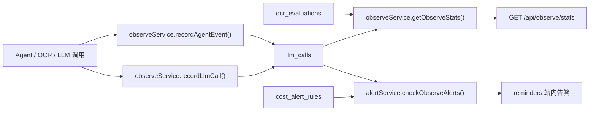

# Smart Finance V3 第四阶段：AI/OCR 全链路观测后端闭环设计

## 背景

前三个阶段已经完成了 Smart Finance V3 的主要用户可感知链路：

1. 第一阶段完成 MySQL、Redis、Qdrant、Agent 记账主链路和自然语言记账。
2. 第二阶段完成 OCR 人工确认闭环，OCR 结果不再直接写库，用户确认后再生成记录。
3. 第三阶段完成提醒中心增强，预算提醒可以以结构化 `display` 字段展示，并支持单条已读和报表页风险提醒。

当前项目已经具备观测系统的基础表结构：

- `llm_calls`：记录 Agent、LLM、OCR 等调用事件。
- `ocr_evaluations`：记录 OCR 识别结果、用户确认和用户修正情况。
- `cost_alert_rules`：记录 AI 成本告警阈值。

但当前观测闭环还比较薄：

- `server/src/services/observeService.js` 只提供 `recordAgentEvent()` 和简单的 `getObserveStats()` 聚合。
- `/api/observe/stats` 只返回按 `call_type` 聚合的 `llmStats`，无法支撑后续观测面板。
- 还没有统一的 `recordLlmCall()` 入口。
- 还没有成本、失败率或连续失败告警服务。
- OCR 正确率已经有数据来源，但没有对外统计。

本阶段聚焦“后端观测闭环”，先把统计、告警和测试地基补齐，不新增复杂前端观测大屏。

## 目标

第四阶段完成后，系统应具备一个可测试、可扩展的后端观测能力：

1. 能统一记录 AI/Agent/OCR 调用事件，包括 provider、model、调用类型、token、延迟、成本、成功状态和错误信息。
2. `/api/observe/stats` 能返回用户可用的聚合统计，包括总调用、总成本、平均延迟、失败数、按类型聚合、按 provider 聚合和 OCR 正确率。
3. 能根据明确规则生成站内告警提醒，覆盖单次高成本、周期成本超阈值和连续失败。
4. 所有统计查询默认限定当前登录用户，避免跨用户数据泄漏。
5. 保留现有 Agent 事件记录方式，不破坏自然语言记账和 OCR 确认主链路。

## 非目标

本阶段不做以下事项：

- 不新增前端观测大屏或图表页。
- 不接真实微信订阅告警推送，只生成站内 `reminders`。
- 不接真实 OpenAI、Claude 或智谱计费 API；成本字段由调用方传入或保持默认。
- 不改变自然语言记账、OCR 识别、OCR 确认的用户流程。
- 不改数据库结构；复用现有 `llm_calls`、`ocr_evaluations`、`cost_alert_rules` 和 `reminders` 表。
- 不实现 Bad Case JSONL 导出；该能力留到后续人机协同数据集阶段。

## 推荐方案

采用“观测服务增强 + 告警服务独立 + 路由轻量聚合”的方案。



该方案的取舍：

- 先把统计口径和告警规则固化在后端，后续前端观测面板可以直接消费。
- `alertService` 与 `observeService` 分离，避免统计查询和副作用写提醒混在一起。
- 使用现有表结构，不引入迁移风险。
- 每个服务都支持 `dbClient` 依赖注入，便于单元测试。

## 后端设计

### observeService 增强

`server/src/services/observeService.js` 保留现有 `recordAgentEvent()`，新增或增强以下能力：

#### `recordLlmCall(input)`

职责：统一写入 `llm_calls`。

输入字段：

- `userId`
- `conversationId`
- `provider`
- `model`
- `callType`
- `inputTokens`
- `outputTokens`
- `latencyMs`
- `costUsd`
- `success`
- `errorMessage`
- `dbClient`

默认值：

- `provider = "local"`
- `model = "unknown"`
- `callType = "llm"`
- token、成本、延迟默认为 0
- `success = true`

输出：

```json
{
  "status": "succeeded",
  "success": true
}
```

或：

```json
{
  "status": "failed",
  "success": false
}
```

#### `recordAgentEvent(input)`

继续保留给 Agent 调用，但内部改为复用 `recordLlmCall()`：

- `provider = "local"`
- `model = "agent"`
- `callType = input.callType || "agent"`
- token 和成本默认为 0

这样可以减少两套写入逻辑。

#### `getObserveStats(input)`

职责：为 `/api/observe/stats` 提供完整聚合。

输入字段：

- `userId`
- `period = "30d"`
- `dbClient`

支持的 `period`：

- `1d`
- `7d`
- `30d`

非法 period 使用 `30d`。

输出结构：

```json
{
  "summary": {
    "calls": 12,
    "failures": 1,
    "successRate": 91.67,
    "totalCostUsd": 0.123456,
    "avgLatencyMs": 345
  },
  "byType": [
    { "callType": "agent", "calls": 8, "failures": 0, "totalCostUsd": 0, "avgLatencyMs": 20 }
  ],
  "byProvider": [
    { "provider": "local", "calls": 8, "failures": 0, "totalCostUsd": 0 }
  ],
  "ocr": {
    "total": 10,
    "confirmed": 8,
    "corrected": 2,
    "accuracy": 75
  },
  "period": {
    "key": "30d",
    "days": 30
  }
}
```

统计口径：

- `calls`：`llm_calls` 行数。
- `failures`：`success = 0` 的行数。
- `successRate`：`(calls - failures) / calls * 100`，无调用时为 100。
- `totalCostUsd`：`SUM(cost_usd)`。
- `avgLatencyMs`：`AVG(latency_ms)` 四舍五入。
- OCR `total`：当前用户 `ocr_evaluations` 行数。
- OCR `confirmed`：`user_confirmed = 1` 行数。
- OCR `corrected`：`user_corrected = 1` 行数。
- OCR `accuracy`：已确认样本中 `ocr_correct = 1` 的比例；无已确认样本时为 `null`。

安全边界：

- 路由层默认使用 `req.userId`。
- 普通用户不能通过 query 读取其他用户统计。
- 现有 `userId` query 能力不再作为默认公开能力使用；如后续需要管理员视角，应单独加权限判断。

### alertService 新增

新增 `server/src/services/alertService.js`。

职责：根据观测数据生成站内提醒，不负责统计展示。

#### `checkObserveAlerts(input)`

输入字段：

- `userId`
- `lastCall`
- `dbClient`

规则：

1. 单次调用成本过高  
   当 `lastCall.costUsd > 0.5` 时，生成 `type = "alert:cost_spike"` 的 `reminders`。

2. 周期成本超过阈值  
   读取 `cost_alert_rules` 中当前用户启用规则；如果没有用户规则，读取全局规则 `user_id IS NULL`。统计 `period_days` 内成本，超过 `threshold_usd` 时生成 `type = "alert:cost_threshold"`。

3. 连续失败  
   查询当前用户最近 3 条 `llm_calls`。如果全部 `success = 0`，生成 `type = "alert:llm_failures"`。

去重策略：

- 同一用户、同一类型、当天已有 `pending` 提醒时，不重复创建。
- 去重范围只针对 `reminders.created_at` 当天。

输出：

```json
{
  "created": [
    { "type": "alert:cost_spike", "severity": "warning" }
  ]
}
```

提醒内容：

- `alert:cost_spike`：`AI 单次调用成本较高：$0.6000`
- `alert:cost_threshold`：`AI 成本已超过阈值：$12.50 / $10.00`
- `alert:llm_failures`：`AI 调用连续失败 3 次，请检查服务配置`

### observe 路由增强

`server/src/routes/observe.js` 保持 `GET /api/observe/stats`：

- 使用 `authMiddleware`。
- 默认使用 `req.userId`。
- 支持 `period` query。
- 返回 `getObserveStats({ userId: req.userId, period })`。

本阶段不新增公开写入接口。观测写入仍由后端服务内部调用，避免客户端伪造观测数据。

## 数据边界

- 不新增表。
- 不修改已有字段。
- 所有观测查询都按 `user_id` 限定。
- `user_id IS NULL` 的 `cost_alert_rules` 只作为全局默认规则读取，不作为统计对象。
- `reminders` 中新增的告警类型使用 `alert:*` 命名，兼容第三阶段的普通提醒展示逻辑。
- `reminders.message` 使用普通文本，不在本阶段引入新的 JSON display 格式。

## 错误处理

- 写入 `llm_calls` 失败时向上抛错，由调用方决定是否阻断主流程；当前 Agent 事件仍可在测试中通过注入 fake service 避免真实数据库。
- 统计接口遇到空数据返回空数组和 0 值，不返回 500。
- `period` 非法时使用 `30d`，不报错。
- 告警服务无法读取规则时不创建提醒，并返回 `created: []`。
- 重复提醒命中去重时不创建新行。

## 测试策略

后端使用 Node 内置 test：

1. `observeService.test.js`
   - `recordLlmCall()` 能写入完整调用数据。
   - `recordAgentEvent()` 复用 `recordLlmCall()` 默认字段。
   - `getObserveStats()` 能返回 summary、byType、byProvider 和 OCR accuracy。
   - 非法 period 回退到 30d。

2. `alertService.test.js`
   - 单次高成本会创建 `alert:cost_spike`。
   - 周期成本超过阈值会创建 `alert:cost_threshold`。
   - 最近 3 次失败会创建 `alert:llm_failures`。
   - 当天已有同类 pending 提醒时不会重复创建。

3. `observeRoute.test.js`
   - `/api/observe/stats?period=7d` 使用当前登录用户。
   - 不允许通过 query 切换到其他用户统计。

集成验证：

- `server npm test`
- `client npm run build`
- `docker compose up -d --build backend frontend`
- Docker smoke：
  - 插入一条 `llm_calls` 和一条 `ocr_evaluations`
  - 调用 `/api/observe/stats?period=30d`
  - 确认返回 `summary.calls >= 1` 和 `ocr.total >= 1`

## 验收标准

- `/api/observe/stats` 返回完整观测结构，而不只是简单 `llmStats`。
- 统计接口默认只统计当前登录用户数据。
- OCR 正确率能从 `ocr_evaluations` 聚合出来。
- 告警服务能根据成本和失败规则写入 `reminders`。
- 告警提醒不会在同一天重复刷屏。
- 后端测试通过，前端构建通过，Docker smoke 通过。

## 后续延展

完成本阶段后，下一阶段可以在此基础上继续做：

- 前端观测面板：统计卡片、趋势图、Provider 占比、OCR 正确率。
- Bad Case 数据集导出：从 `ocr_evaluations` 和 `feedback` 构建 JSONL。
- Insight 反馈：用户对分析建议点赞/点踩并写入 `feedback`。
- 微信订阅告警：把 `alert:*` 提醒推送到微信订阅消息。
