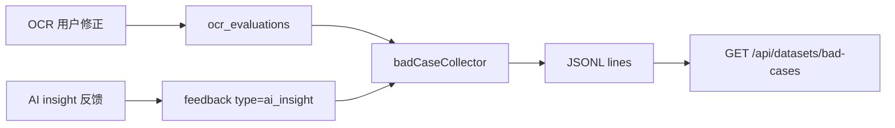

# Smart Finance V3 第五阶段：Insight 反馈与 Bad Case 数据集设计

## 背景

前四个阶段已经把 Smart Finance V3 的核心链路搭起来：

1. 自然语言记账、MySQL/Redis/Qdrant 和 Agent 主链路已经可用。
2. OCR 已经改为“识别结果暂存 → 用户确认 → 写入 records → 回写 ocr_evaluations”。
3. 提醒中心已能展示可读预算提醒。
4. 后端观测闭环已能统计 AI/Agent/OCR 调用、OCR 正确率，并生成成本/失败告警。

下一步需要把“用户纠错”沉淀成可复用数据资产。当前系统已经有两类高价值信号：

- `ocr_evaluations`：记录用户是否修正 OCR 识别结果，适合生成 OCR Bad Case。
- `feedback`：已有用户反馈表，适合承载 AI 洞察反馈，例如“这条分析不准确，原因是……”

本阶段聚焦后端数据闭环：让用户对 AI 分析结果提交结构化反馈，并能导出 OCR/Insight Bad Case JSONL，作为后续提示词优化、规则优化或模型微调的数据来源。

## 目标

第五阶段完成后，系统应具备以下能力：

1. 提供 AI insight 反馈接口，用户可以标注某条分析是否准确，并填写修正意见。
2. Insight 反馈写入现有 `feedback` 表，使用 `type = "ai_insight"`。
3. 不准确反馈自动标为 `priority = "P1"`，准确反馈标为 `priority = "P2"`。
4. 新增 Bad Case 汇总服务，从 `ocr_evaluations` 和 `feedback` 生成 JSONL 数据。
5. 提供后端导出接口，当前登录用户只能导出自己的 Bad Case。
6. 后端测试、前端构建和 Docker smoke 可以验证该能力。

## 非目标

本阶段不做以下事项：

- 不新增前端页面或复杂 UI。
- 不上传数据集到 OpenAI、Claude、智谱或其他模型平台。
- 不真正启动模型微调。
- 不改 `feedback` 表结构。
- 不改 OCR 确认流程。
- 不改报表生成逻辑或引入新的 Analyzer Agent 输出格式。
- 不导出其他用户数据。

## 推荐方案

采用“复用 feedback 表 + 独立 badCaseCollector 服务 + 轻量导出路由”的方案。



这个方案的优点：

- 不新增表，风险小。
- 直接复用已存在的 `ocr_evaluations` 和 `feedback`。
- 先交付后端可验证能力，后续前端页面可以直接消费。
- JSONL 是轻量通用格式，后续可用于人工复盘、提示词优化或微调数据准备。

## 后端设计

### Insight 反馈接口

建议新增一个小路由模块：

`server/src/routes/insights.js`

接口：

`POST /api/insights/feedback`

请求体：

```json
{
  "insightId": "report-2026-07-food-risk",
  "reportId": 12,
  "isAccurate": false,
  "correction": "餐饮上涨是因为本月有一次家庭聚餐，不应判定为长期趋势。",
  "context": {
    "summary": "本月餐饮支出异常上涨",
    "period": "2026-07"
  }
}
```

行为：

- 必须登录，使用 `authMiddleware`。
- `insightId` 必填。
- `isAccurate` 必须是 boolean。
- `correction` 可选，但当 `isAccurate = false` 时建议填写；后端不强制长文本，避免阻塞用户。
- 写入 `feedback` 表：
  - `user_id = req.userId`
  - `device_id = req.deviceId`
  - `type = "ai_insight"`
  - `priority = isAccurate ? "P2" : "P1"`
  - `status = "pending"`
  - `content = JSON.stringify({ insightId, reportId, isAccurate, correction, context })`

返回：

```json
{
  "success": true,
  "data": {
    "id": 101,
    "priority": "P1"
  }
}
```

### Bad Case 汇总服务

新增：

`server/src/services/badCaseCollector.js`

核心函数：

```js
buildBadCaseDataset({ userId, month, source, dbClient })
```

输入：

- `userId`：当前用户。
- `month`：月份，格式 `YYYY-MM`，默认当前月份。
- `source`：
  - `"ocr"`：只导出 OCR 修正样本。
  - `"insight"`：只导出 AI insight 反馈。
  - `"all"`：两者都导出，默认值。
- `dbClient`：便于测试注入。

输出：

```js
[
  {
    source: "ocr",
    messages: [
      { role: "user", content: "请识别以下小票图片中的账单条目" },
      { role: "assistant", content: "{\"records\":[...]}" },
      { role: "user", content: "用户修正：分类应为「餐饮」，金额应为 88 元" },
      { role: "assistant", content: "{\"records\":[...]}" }
    ],
    metadata: {
      userId: 7,
      recordId: 123,
      month: "2026-07"
    }
  }
]
```

#### OCR Bad Case 规则

从 `ocr_evaluations` 读取：

- `user_id = userId`
- `user_corrected = 1`
- `created_at` 或 `confirmed_at` 位于目标月份

每条记录生成一条 JSONL item：

- 用户消息：固定为“请识别以下小票图片中的账单条目”。
- assistant 原回答：`ocr_result`。
- 用户修正消息：包含 `corrected_category` 和 `corrected_amount`。
- assistant 修正后回答：在原始 OCR 结果基础上覆盖分类和金额。

如果 `ocr_result` 不是合法 JSON：

- 仍导出，但 assistant 原回答使用原始字符串包一层 `{ "raw": "..." }`。

#### Insight Bad Case 规则

从 `feedback` 读取：

- `user_id = userId`
- `type = "ai_insight"`
- `created_at` 位于目标月份

每条 feedback 生成一条 JSONL item：

- 用户消息：包含原 insight 摘要和用户反馈。
- assistant 目标回答：
  - 如果 `isAccurate = false`：表达“已收到修正，并在后续分析中避免该判断”。
  - 如果 `isAccurate = true`：表达“该洞察被用户确认准确”。
- metadata 包含 `feedbackId`、`priority`、`month`。

如果 `feedback.content` 不是合法 JSON：

- 作为普通文本反馈导出，不抛错。

### 数据集导出路由

建议新增：

`server/src/routes/datasets.js`

接口：

`GET /api/datasets/bad-cases?month=2026-07&source=all`

行为：

- 必须登录。
- `month` 默认当前月份。
- `source` 默认 `all`。
- 使用 `buildBadCaseDataset({ userId: req.userId, month, source })`。
- 返回 JSONL 文本，Content-Type 使用 `application/jsonl; charset=utf-8`。

响应示例：

```jsonl
{"source":"ocr","messages":[...],"metadata":{"userId":7,"month":"2026-07"}}
{"source":"insight","messages":[...],"metadata":{"userId":7,"month":"2026-07"}}
```

为了方便测试，也可以支持 `format=json`：

`GET /api/datasets/bad-cases?month=2026-07&source=all&format=json`

返回：

```json
{
  "success": true,
  "data": [
    { "source": "ocr", "messages": [], "metadata": {} }
  ]
}
```

## 数据边界

- 所有查询必须限定 `user_id = req.userId`。
- 不允许通过 query 指定其他用户 ID。
- JSONL 不包含图片文件本体，只包含识别结果和用户修正文本。
- 导出的数据可能包含用户消费信息，因此接口必须鉴权。
- 本阶段不做脱敏；后续如果要上传到第三方平台，需要新增脱敏阶段。

## 错误处理

- `insightId` 缺失：返回 400。
- `isAccurate` 不是 boolean：返回 400。
- `month` 格式非法：使用当前月份，不抛错。
- `source` 非法：使用 `all`。
- 没有 Bad Case：返回空 JSONL 或 `{ success: true, data: [] }`。
- 单条历史数据 JSON 解析失败：该条降级导出，不影响整体导出。

## 测试策略

后端使用 Node 内置 test：

1. `badCaseCollector.test.js`
   - OCR 修正样本能生成 JSONL item。
   - Insight feedback 能生成 JSONL item。
   - `source = "ocr"` 只返回 OCR 数据。
   - 非法 JSON content 能降级导出。

2. `insightsRoute.test.js`
   - `POST /api/insights/feedback` 写入当前用户 feedback。
   - 不准确反馈写为 `priority = "P1"`。
   - 未登录返回 401。
   - 缺少 `insightId` 返回 400。

3. `datasetsRoute.test.js`
   - `GET /api/datasets/bad-cases?format=json` 只能导出当前用户数据。
   - JSONL 格式返回 `application/jsonl`。

集成验证：

- `server npm test`
- `client npm run build`
- `docker compose up -d --build backend frontend`
- Docker smoke：
  - mock 登录。
  - POST 一条 insight feedback。
  - 插入一条 OCR corrected evaluation。
  - GET `/api/datasets/bad-cases?source=all&format=json`。
  - 确认至少返回一条 `ocr` 和一条 `insight`。

## 验收标准

- 用户可以提交 AI insight 准确/不准确反馈。
- 不准确 insight 反馈进入 `feedback` 表且优先级为 `P1`。
- 当前用户可以导出自己的 OCR/Insight Bad Case。
- JSONL 导出格式每行都是独立 JSON 对象。
- 非法历史 JSON 不会导致整体导出失败。
- 后端测试、前端构建和 Docker smoke 通过。

## 后续延展

本阶段完成后，可以继续扩展：

- 前端在报表或分析卡片旁增加 👍/👎 反馈按钮。
- 数据导出前增加脱敏规则，例如隐藏商家、备注、成员名。
- 增加管理员数据集下载入口。
- 增加“上传到微调平台”的离线脚本。
- 把 Bad Case 反向用于优化 OCR prompt 和 Analyzer 规则。
