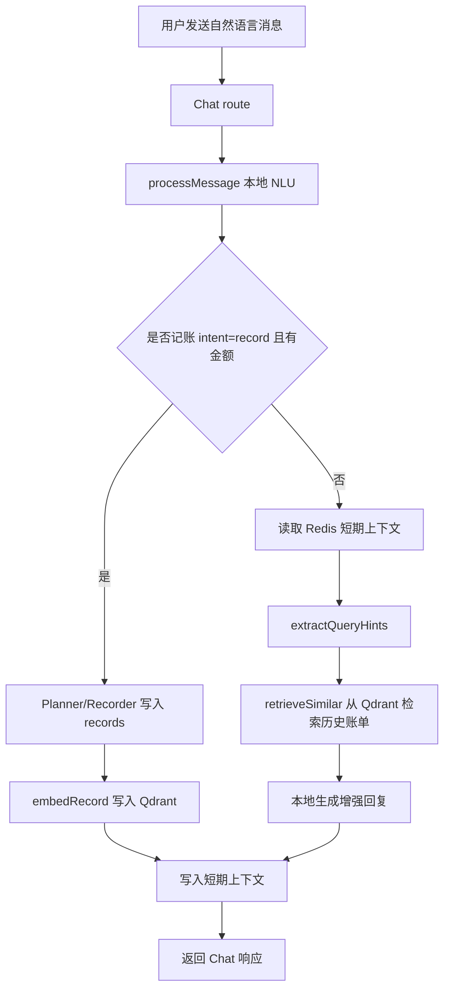

# Smart Finance V3 第六阶段：自然语言上下文记忆与历史账单检索设计

## 背景

前五个阶段已经把 Smart Finance V3 的核心后端能力串起来：

1. 自然语言记账、MySQL、Redis、Qdrant、Docker 基础链路已经可用。
2. OCR 已改造为“识别结果暂存、用户确认、写入记录、回写评估”。
3. 提醒中心可以展示预算风险。
4. 后端观测可以统计 AI、Agent、OCR 调用。
5. Insight 反馈和 Bad Case 数据集导出已经形成纠错闭环。

但当前自然语言聊天仍然偏“单轮解析”：`server/src/routes/chat.js` 只把用户消息交给 `processMessage()`，`server/src/services/vectorMemory.js` 中的 `retrieveSimilar()` 仍是空实现。也就是说，系统已经会把记账记录写进 Qdrant，但还没有在用户提问时真正检索历史账单；Redis 也还没有保存短期对话上下文。

本阶段目标是补上“自然语言理解的记忆层”：让 Chat 在处理查询、建议类消息时，可以结合最近对话和相似历史账单，给出更具体、更像财务助手的回复。

## 目标

第六阶段完成后，系统应具备以下能力：

1. 保存用户最近聊天上下文，支持按用户或设备隔离。
2. 当上下文过长时，保留简短摘要和最近几轮消息，避免 Redis 中无限膨胀。
3. 完成 `retrieveSimilar()`，可以从 Qdrant 检索当前用户相关的历史账单。
4. Chat 在 `query`、`advice`、`chat` 类消息中可以读取历史账单上下文，生成更具体的回复。
5. 在 Redis、Qdrant、OpenAI Embedding 不可用时优雅降级，不影响现有记账功能。
6. 后端测试、前端构建和 Docker smoke 可以验证该能力。

## 非目标

本阶段不做以下事项：

- 不新增前端页面。
- 不新增或修改 MySQL 表结构。
- 不引入新的大型 Agent 编排框架。
- 不把完整财务分析交给外部 LLM。
- 不改变 OCR 确认流程。
- 不改变 Bad Case 数据集格式。
- 不做复杂多轮“修改上一笔记录”的写入动作；本阶段只让上下文进入查询和建议回复。

## 方案取舍

### 方案 A：只做 Redis 短期上下文

优点是实现最简单，风险低。缺点是只能记住最近几句话，无法回答“最近奶茶花了多少”“上个月餐饮趋势”这类需要历史账单的问题。

### 方案 B：只做 Qdrant 历史检索

优点是能立刻复用已经写入向量库的记录。缺点是没有短期上下文，用户追问“那这个月呢”“帮我细分一下”时，系统仍然无法理解前文。

### 方案 C：Redis 短期上下文 + Qdrant 历史检索

这是推荐方案。它同时补齐“最近对话记忆”和“长期账单记忆”，并且可以保持后端可测、范围克制。短期上下文解决多轮追问，长期检索解决历史账单关联；两者都失败时，系统仍回退到现有 NLU 行为。

## 推荐设计

### 1. 短期上下文服务

新增服务：

`server/src/services/conversationContext.js`

职责：

- 用 Redis 保存最近对话。
- Key 使用 `ctx:{identity}`，其中 `identity` 继续沿用 Chat 中的 `user-{userId}` 或 `deviceId`。
- 每条消息结构为：

```js
{
  role: 'user' | 'assistant' | 'system',
  content: '消息内容',
  ts: 1784380800000
}
```

保留策略：

- 最近 8 条消息完整保留。
- 超过 8 条后，把更早消息压成一个本地摘要，不调用外部 LLM。
- 摘要只保留关键信息，例如最近询问的时间范围、分类、金额、用户偏好。
- TTL 默认为 30 分钟。

核心接口：

```js
getConversationContext(identity)
appendConversationMessage(identity, message)
buildContextSummary(messages)
clearConversationContext(identity)
```

降级策略：

- Redis 不可用时返回空上下文。
- 写入 Redis 失败时只记录 warning，不阻断 Chat。

### 2. 长期历史账单检索

补全已有服务：

`server/src/services/vectorMemory.js`

重点实现：

```js
retrieveSimilar(query, {
  userId,
  month,
  category,
  limit = 5,
  client,
  getEmbedding
})
```

行为：

- 使用 `getEmbedding(query)` 获取查询向量。
- 调用 Qdrant search/query API。
- 过滤条件必须包含 `payload.userId = userId`。
- 如果传入 `month`，追加 `payload.month = month`。
- 如果传入 `category`，追加 `payload.category = category`。
- 返回轻量记录数组，不暴露原始向量。

返回示例：

```js
[
  {
    recordId: 12,
    date: '2026-07-18',
    category: '餐饮',
    amount: 88,
    merchant: '某餐厅',
    description: '晚餐',
    score: 0.82
  }
]
```

降级策略：

- Qdrant 不可用时返回空数组。
- Embedding 失败时返回空数组。
- 未登录用户没有 `userId` 时不做长期检索，避免跨设备或跨用户数据混杂。

### 3. Chat 查询增强

改造：

`server/src/routes/chat.js`

保持现有记账链路不变：

- `intent = record` 且有金额时，仍走 Planner → Recorder → Monitor → Observe。
- 记账成功后，把用户消息和助手回复写入短期上下文。

新增查询增强逻辑：

- 对 `intent = query`、`intent = advice`、普通 `chat`：
  1. 读取短期上下文。
  2. 从用户消息中提取轻量检索 hint，例如月份、分类。
  3. 调用 `retrieveSimilar()` 获取相关历史账单。
  4. 用本地规则生成增强回复。
  5. 将本轮用户消息和回复写入短期上下文。

本阶段不依赖外部 LLM，先用可测的本地生成：

- 如果检索到记录，返回“我找到 N 条相关记录，总金额约 X 元，主要集中在 A/B 分类”。
- 如果没有检索到记录，返回现有 NLU 的默认回复。
- 如果用户问建议，结合检索结果给出一条保守建议，例如“这类支出近期较集中，可以先设置分类预算或观察本月占比”。

### 4. 查询 hint 解析

新增一个小工具函数，放在 Chat 相关服务中，避免扩大 NLU 文件职责：

```js
extractQueryHints(message)
```

支持最小集合：

- “本月” → 当前 `YYYY-MM`
- “上月” → 上一个 `YYYY-MM`
- “餐饮 / 交通 / 购物 / 娱乐 / 住房 / 医疗 / 教育 / 通讯 / 礼物” → category
- 未识别则不加过滤

这一步只做确定性规则，不做复杂自然语言时间解析。

## 数据流



## 错误处理

- Redis 读取失败：记录 warning，使用空上下文继续。
- Redis 写入失败：记录 warning，不影响接口响应。
- Qdrant 检索失败：返回空历史记录，不影响接口响应。
- Embedding API 失败：返回空历史记录；如果没有 OpenAI Key，继续使用现有 deterministic embedding。
- Chat 主流程异常：保持现有兜底响应。

## 数据边界与安全

- 长期检索必须使用 `userId` 过滤。
- 未登录用户只使用短期设备上下文，不访问 Qdrant 长期账单。
- Query 参数或请求体不得允许覆盖 `userId`。
- 返回给前端的相关记录只包含必要字段：日期、分类、金额、商户、备注，不返回向量和底层 payload。
- 本阶段不把聊天上下文上传到外部平台。

## 测试策略

后端测试使用 Node 内置 test：

1. `conversationContext.test.js`
   - 可以追加并读取上下文。
   - 超过 8 条后生成摘要并保留最近消息。
   - Redis 失败时降级为空上下文。

2. `vectorMemoryRetrieve.test.js`
   - `retrieveSimilar()` 调用 Qdrant 时包含 `userId` filter。
   - 支持 `month` 和 `category` 过滤。
   - Qdrant 失败时返回空数组。

3. `chatMemoryRoute.test.js`
   - query/advice 消息会调用上下文和历史检索。
   - 未登录用户不会调用长期检索。
   - 记账成功后仍保留现有 record 行为，并写入上下文。

集成验证：

- `cd server && npm test`
- `cd client && npm run build`
- `JWT_SECRET=... docker compose up -d --build backend frontend`
- Docker smoke：
  - mock login。
  - 用自然语言记一笔餐饮支出。
  - 查询“本月餐饮花了多少”。
  - 确认返回包含相关记录数量或总金额提示。

## 验收标准

- Chat 仍能完成现有自然语言记账。
- Chat 对查询/建议类消息可以结合历史账单生成更具体回复。
- `retrieveSimilar()` 不会跨用户返回数据。
- Redis/Qdrant 不可用时接口仍可返回可用结果。
- 后端测试、前端构建和 Docker smoke 通过。

## 后续扩展

本阶段完成后，可以继续扩展：

- 接入外部 LLM 生成更自然的财务分析回复。
- 支持“把刚才那笔改成餐饮”这类上下文写操作。
- 支持更完整的时间表达式，例如“过去三个月”“上周末”。
- 把 Bad Case 反馈结果反向用于查询回复的提示词优化。
- 在前端展示“引用了哪些历史账单”的可解释列表。
