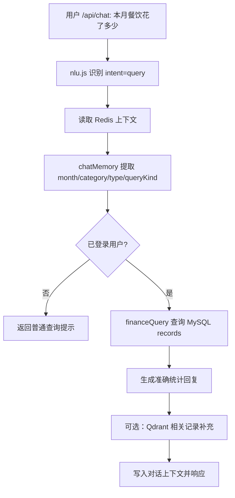

# Smart Finance V3 阶段 7：自然语言账本查询增强设计

## 背景

当前项目已经完成到阶段 6：

- 自然语言记账可以通过 `/api/chat` 进入 Planner / Recorder 流程。
- Chat 已接入 Redis 短期上下文与 Qdrant 历史记录检索。
- 但是用户问“本月餐饮花了多少”“上月收入多少”时，Chat 仍主要返回通用说明，不能稳定给出来自 MySQL 账本的准确统计。

阶段 7 的目标是补齐这个最影响用户感知的缺口：让自然语言查账优先走 MySQL 聚合查询，Qdrant 仅作为相关记录补充，不再承担总额统计职责。

## 4 个剩余阶段路线

1. 阶段 7：自然语言账本查询增强。
2. 阶段 8：报表、导出、分享闭环。
3. 阶段 9：微信登录、订阅消息、提醒确认闭环。
4. 阶段 10：生产化收尾、部署文档、端到端验收。

本设计只覆盖阶段 7。

## 设计目标

阶段 7 完成后，登录用户可以用自然语言查询真实账本统计：

- “本月餐饮花了多少”
- “上月购物支出多少”
- “本月收入多少”
- “最近几笔餐饮”
- “最大一笔支出是什么”

系统应返回准确的总金额、笔数、分类或最近记录摘要，并继续保留阶段 6 的上下文能力。例如用户先问“本月餐饮花了多少”，再问“那上月呢”，系统能从上下文继承“餐饮”分类。

## 非目标

本阶段不做以下事情：

- 不新增前端页面。
- 不改 MySQL 表结构。
- 不引入 LLM 生成 SQL。
- 不做复杂多轮 SQL 推理。
- 不替换 Qdrant 检索；只调整其在 Chat 查询中的定位。
- 不处理报表导出、微信订阅消息、生产部署，这些留到阶段 8-10。

## 推荐方案

采用“规则解析 hint + MySQL 聚合 + Chat 组装回复”的方案。

### 为什么不只靠 Qdrant

Qdrant 适合找相似记录，但不适合回答“总共多少钱”。向量召回可能漏记录，因此不能作为财务总额依据。

### 为什么不用 LLM 生成 SQL

LLM 生成 SQL 会带来权限、注入、稳定性与可测试性问题。当前项目更适合先用明确规则覆盖高频查账问题。

## 架构

新增一个只读查询服务：

- `server/src/services/financeQuery.js`

它负责：

- 根据 `userId`、月份、分类、收支类型过滤 `records`。
- 聚合总额、笔数、平均值、最大一笔。
- 返回最近记录列表。
- 所有查询必须带 `user_id` 过滤。

扩展已有服务：

- `server/src/services/chatMemory.js`
  - 增强自然语言 query hint 提取。
  - 输出查询类型，例如 `summary`、`recent`、`largest`。
- `server/src/routes/chat.js`
  - query intent 下优先调用 `financeQuery`。
  - 成功查到账本统计时，用准确统计回复用户。
  - Qdrant 继续作为 `memory.records` 的补充信息。
  - MySQL 查询失败时降级为原本的 Chat 回复，不阻断接口。

## 数据流

## 回复策略

### summary 查询

用户问“多少 / 合计 / 统计”时，回复示例：

> 本月餐饮支出共 125.50 元，合计 4 笔，最大一笔是 58.00 元。

### recent 查询

用户问“最近几笔 / 最近记录”时，回复示例：

> 最近找到 3 笔餐饮记录：7 月 18 日 25.00 元，7 月 16 日 38.00 元，7 月 12 日 58.00 元。

### largest 查询

用户问“最大一笔 / 最贵 / 最高”时，回复示例：

> 本月餐饮最大一笔是 58.00 元，记录在 2026-07-12。

### 无数据

回复示例：

> 没找到本月餐饮支出记录。你可以先记一笔，例如“今天餐饮花了25元”。

## 边界条件

- 未登录用户不能查长期账本，只返回普通引导。
- 所有 MySQL 查询必须限制 `user_id`。
- 金额优先使用 `amount_cny`，为空时回退 `amount`。
- 月份使用本地年月计算，避免 UTC 月份边界。
- `financeQuery` 失败时记录日志并降级，不影响 Chat 成功响应。
- Qdrant 召回结果不能参与精确总额计算。
- 阶段外既有脏文件保持不动。

## 测试策略

新增与修改测试：

- `server/test/financeQuery.test.js`
  - 验证 userId 隔离。
  - 验证 month/category/type 聚合。
  - 验证最近记录与最大一笔。
  - 验证无数据回复模型。
- `server/test/chatMemory.test.js`
  - 验证 queryKind 提取。
  - 验证 context 继承仍可用。
- `server/test/chatRoute.test.js`
  - 验证“本月餐饮花了多少”会调用 MySQL 聚合并返回准确统计。
  - 验证 financeQuery 慢或失败时 Chat 降级成功。

最终验证：

- `cd server && npm test`
- `cd client && npm run build`
- Docker 重建 backend/frontend。
- Docker 冒烟：登录、自然语言记账、自然语言查账，返回真实金额。

## 验收标准

- 后端测试通过。
- 前端构建通过。
- Docker backend healthy。
- 冒烟中，记入“今天餐饮花了25元”后，查询“本月餐饮花了多少”能返回包含 25.00 元的统计回复。
- 阶段 7 相关文件已提交，暂存区为空。
