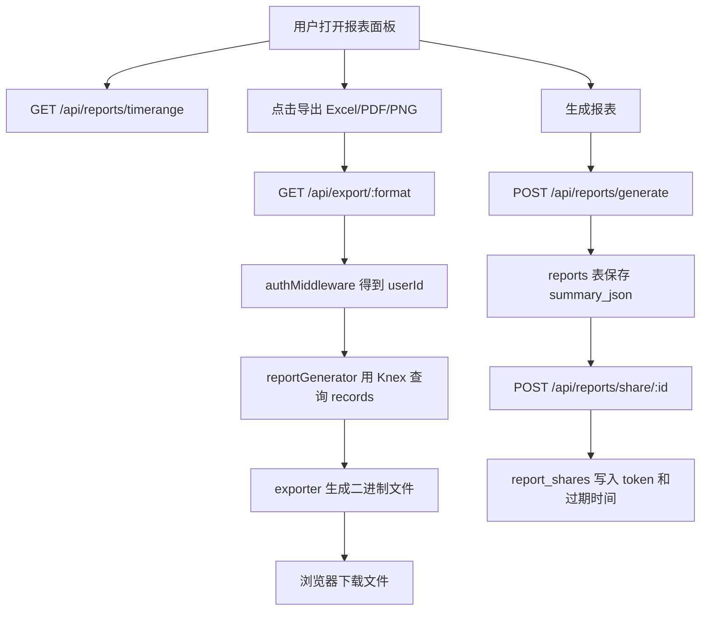

# Smart Finance V3 阶段 8：报表、导出、分享闭环设计

## 背景

项目已经完成阶段 7：自然语言查账可以从 MySQL `records` 表返回准确聚合。下一步需要把“账本数据能看、能导出、能分享”的闭环补齐。

当前代码中已经存在报表和导出相关雏形：

- `server/src/routes/reports.js` 已有月度、分类、趋势、手动生成、历史、分享接口。
- `client/src/components/ReportPanel.vue` 已有报表展示和导出按钮。
- 工作区中存在未跟踪的 `server/src/services/reportGenerator.js`、`server/src/services/exporter.js`、`server/src/routes/export.js`。

但这些未跟踪文件混有旧 SQLite 风格实现，例如 `db.prepare(...)`。当前项目已经迁移到 MySQL/Knex，因此阶段 8 要将这些文件正式接管并改造成 Knex 实现。

## 目标

阶段 8 完成后：

- 用户可以生成月度报表并查看历史记录。
- 用户可以导出当前报表为 Excel、PDF、PNG。
- 用户可以为已生成的报表创建 7 天有效分享链接。
- 所有报表、导出、分享操作都按 `user_id` 隔离。
- 前端现有报表面板导出按钮可以调用稳定接口。

## 非目标

本阶段不做以下事情：

- 不重做前端报表页面视觉设计。
- 不新增公开分享落地页。
- 不新增复杂报表模板系统。
- 不新增微信分享能力。
- 不改 MySQL 表结构。
- 不改自然语言查账、OCR、Bad Case、观测链路。

## 推荐方案

采用“后端闭环优先，前端轻量接通”的方案。

### 方案 A：只修导出接口

优点是快；缺点是报表生成、历史、分享仍不完整，验收价值有限。

### 方案 B：报表生成 + 导出 + 分享后端闭环，前端按钮接通

这是推荐方案。它能形成完整可验收链路，同时避免重做前端 UI。

### 方案 C：完整重做报表前端

体验最好，但会碰大量现有前端脏文件，阶段范围过大，留到阶段 10 统一体验收尾更合适。

## 架构

### `reportGenerator`

文件：`server/src/services/reportGenerator.js`

职责：

- 使用 Knex/MySQL 查询 `records`。
- 支持 `periodType=month/year/quarter/week`。
- 支持 `ledgerId/category/member/merchant/project` 过滤。
- 输出统一 report model：
  - `period`
  - `income`
  - `expense`
  - `balance`
  - `incomeByCurrency`
  - `expenseByCurrency`
  - `byCategory`
  - `count`
  - `records`

### `exporter`

文件：`server/src/services/exporter.js`

职责：

- `buildExcelBuffer(report)` 生成 `.xlsx` buffer。
- `buildPdfBuffer(report)` 生成 `.pdf` buffer。
- `buildImageBuffer(report)` 生成 `.png` buffer。
- `makeShareQr(url)` 生成二维码 buffer。

导出函数不直接依赖 Express `res`，便于单元测试。

### `/api/export`

文件：`server/src/routes/export.js`

职责：

- `GET /api/export/excel`
- `GET /api/export/pdf`
- `GET /api/export/image`

接口全部使用 `authMiddleware`，只导出当前用户数据。

### 报表分享

继续使用既有 `POST /api/reports/share/:id`。

阶段 8 要补强边界：

- 分享前确认 report 属于当前用户。
- 分享记录写入 `report_shares`。
- 返回可访问 URL。

## 数据流

## 安全与边界

- 导出接口必须登录。
- 报表生成、历史、分享必须按 `user_id` 限制。
- 分享接口不能为其他用户的 report 创建 token。
- 导出文件名不使用用户输入，避免 header 注入。
- PDF 中文字体缺失时允许降级，但接口不能崩。
- 查询失败返回 500 JSON；二进制流生成失败不能写半截响应。
- 阶段外脏文件保持不动。

## 测试策略

新增/修改测试：

- `server/test/reportGenerator.test.js`
  - 验证 period range。
  - 验证 Knex 查询按 userId、month、category 聚合。
  - 验证 records 明细 limit/offset。
- `server/test/exporter.test.js`
  - 验证 Excel/PDF/PNG buffer 非空且文件头正确。
- `server/test/exportRoute.test.js`
  - 验证导出接口要求登录。
  - 验证 Excel/PDF/PNG Content-Type。
  - 验证传入筛选条件时调用 reportGenerator。
- `server/test/reportShare.test.js`
  - 验证只能分享自己的 report。
  - 验证成功分享返回 URL。

最终验证：

- `cd server && npm test`
- `cd client && npm run build`
- Docker 重建 backend/frontend。
- Docker 冒烟：
  - 登录。
  - 自然语言记账至少一笔。
  - 调用 Excel/PDF/Image 导出接口，检查 Content-Type。
  - 生成报表并创建分享链接。

## 验收标准

- 后端测试通过。
- 前端构建通过。
- Docker backend healthy。
- Excel/PDF/Image 导出接口在容器内返回正确 Content-Type。
- 分享接口不能分享其他用户 report。
- 阶段 8 相关文件已提交，暂存区为空。
