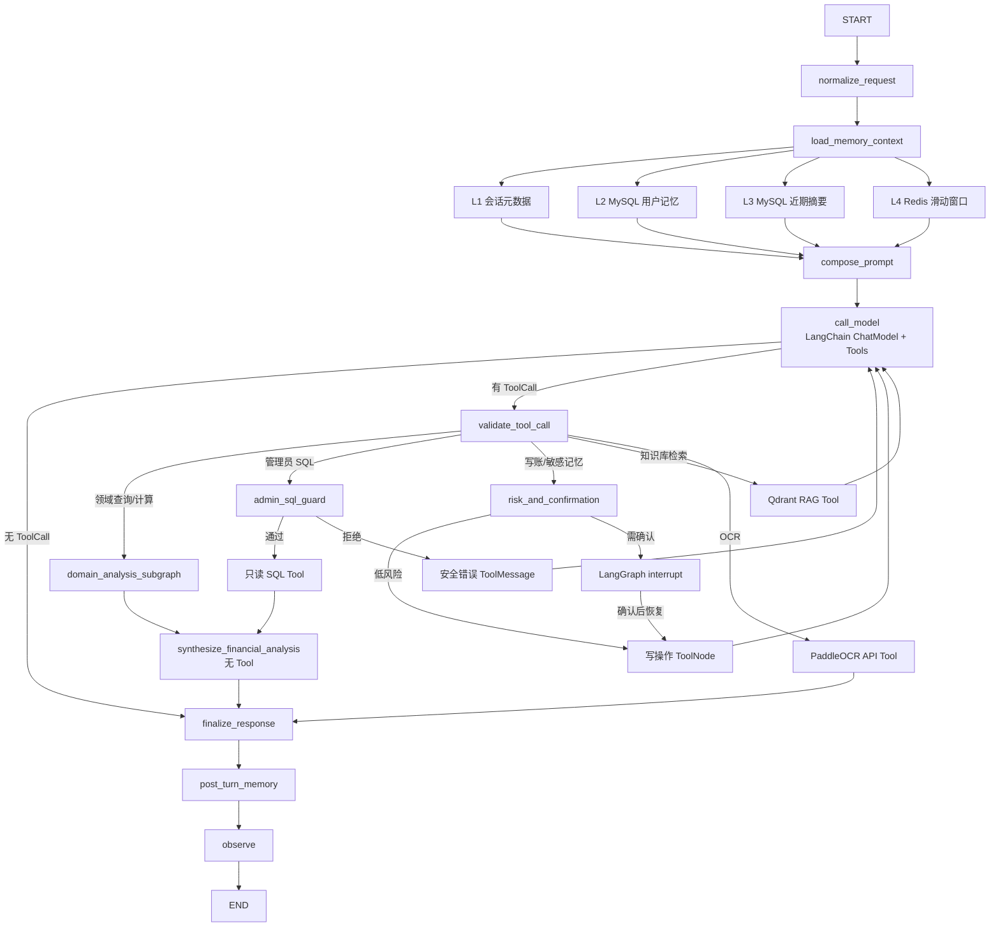
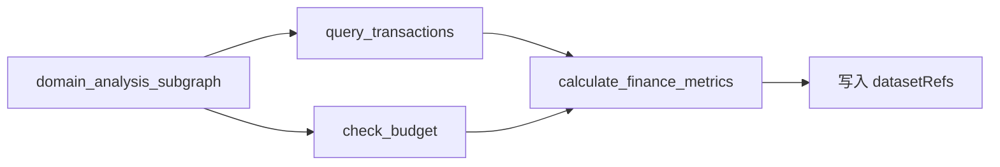

# Smart Finance：LangGraph Agent 与四层 Memory 设计

日期：2026-07-26
状态：设计已确认，实施已完成（剩余 Task 14-17 补全），参见实施计划 `docs/superpowers/plans/2026-07-26-smart-finance-langgraph-four-layer-memory-implementation.md`
适用项目：`E:\Smart Finance`

## 1. 目标

本阶段完成两个首要目标：

1. 以 LangGraph.js 作为 Agent 主体，负责状态管理、多轮交互、工具编排、条件分支、人工确认和中断恢复。
2. 建立四层 Memory：会话元数据、结构化用户记忆、近期对话摘要和 Redis 滑动窗口。

同时遵守以下项目约束：

- 现有记账、SQL/RAG 检索、金额计算和预算计算函数只做 Tool 封装，不修改内部核心逻辑。
- 现有 Node.js + Express 服务继续作为唯一业务后端。
- 财务模型温度固定为 `0.1`。
- 旧 `/api/chat` 请求与响应契约保持兼容。
- 普通账单、用户档案和近期对话不再进入 Qdrant。
- 所有新能力均可通过环境变量关闭或灰度启用。

## 2. 已确认技术选型

| 层次 | 选型 | 职责 |
|---|---|---|
| Agent 主体 | LangGraph.js `StateGraph` | 状态、分支、循环、中断、恢复 |
| AI 组件 | LangChain.js | 模型连接、Zod Tool、Prompt、消息、RAG |
| Web 服务 | Node.js + Express | 鉴权、接口兼容、Runtime Context |
| 权威账务数据 | MySQL | 账单、预算、用户记忆、摘要、审计 |
| 短期状态 | Redis | 滑动窗口、Graph Checkpoint、临时数据集 |
| 语义检索 | Qdrant | PDF、录音转写、长文档、大规模工单 |
| OCR | PaddleOCR 官方托管 API TypeScript SDK | 小票文字及版面识别 |
| LLM | OpenAI 兼容公有 API | Function Calling 与分析生成 |

Firefly III 首轮不接入运行链路，仅借鉴其账户、预算、标签、周期交易等领域模型。后续如需接入，单独设计数据权威和迁移方案。

## 3. 总体架构



## 4. AgentState

```text
AgentState
├── messages
├── userId
├── sessionId
├── sessionMetadata
├── userMemory
├── recentSummary
├── datasetRefs
├── pendingConfirmation
├── toolCallCount
├── errors
├── response
├── requestStartTime
├── isAdmin
└── intentType
```

字段约束：

- `userId`、`sessionId` 和 `isAdmin` 由服务端鉴权及会话中间件注入，LLM 和 Tool 参数不能覆盖。
- `requestStartTime` 使用当前 HTTP/Graph 调用开始时的 Epoch 毫秒。中断恢复视为一次新请求，不把用户等待时间计入接口耗时。
- `intentType` 支持 `record`、`query`、`stat`、`analysis`、`suggest`、`ocr`、`chat` 和 `unknown`。
- 复合意图使用 `+` 连接，例如 `stat+analysis+suggest`。
- 日志同时记录初始意图和 Tool 执行后校正的最终意图。
- `datasetRefs` 只保存临时数据集标识和元数据，不保存完整账单数组。
- `pendingConfirmation` 只保存待确认操作的规范化参数、风险原因、幂等键和过期时间。

## 5. Graph 节点职责

### 5.1 `normalize_request`

- 校验认证信息、`sessionId`、请求体和消息长度。
- 解析设备类型、时区、语言、输入方式等会话元数据。
- 设置 `requestStartTime` 和 `isAdmin`。
- 识别单一或复合意图并写入 `intentType`。
- 创建请求级 `operationId`，供写操作幂等控制。

### 5.2 `load_memory_context`

仅加载四层 Memory，不加载历史账单、实时预算或统计结果：

- L1：会话元数据。
- L2：稳定偏好和已确认用户事实。
- L3：近期话题、历史建议和未完成规划。
- L4：当前会话最近消息。

历史账单、实时预算额度和当前消费金额必须通过领域 SQL Tool 获取。

### 5.3 `compose_prompt`

Prompt 注入顺序：

1. 系统安全与财务规则。
2. L1 会话元数据。
3. L2 结构化用户记忆。
4. L3 近期摘要。
5. L4 滑动窗口。
6. 当前用户输入。

冲突优先级：

```text
当前明确输入
> 已确认用户记忆
> 近期摘要
> 滑动窗口旧内容
> 会话回复风格
```

复合任务规则：

1. `统计/查询 + 分析 + 建议` 必须先调用领域 Tool 获取客观数据。
2. 分析只能基于 Tool 返回的数据、已确认用户记忆和近期摘要。
3. 建议仅覆盖记账、预算和消费规划，不提供投资标的或收益承诺。
4. 工具数据不足时必须明确说明，不得补造账单或金额。

### 5.4 `call_model`

- 使用 LangChain ChatModel。
- `temperature=0.1`。
- 允许调用领域、记忆、OCR 和知识库 Tool。
- 受 `AGENT_MAX_TOOL_CALLS` 和 Graph recursion limit 限制。
- Tool 参数由 Zod Schema 验证。

### 5.5 `validate_tool_call`

- 根据 `intentType`、Tool 类型、`isAdmin`、当前数据集和待确认状态决定路由。
- 阻止模型把 `userId`、角色、数据库连接或任意 SQL 作为 Tool 参数。
- 检查计算 Tool 是否引用真实 `datasetRef`。
- 检查写操作是否具有 `operationId`。

### 5.6 `domain_analysis_subgraph`

复合统计使用确定性子图，不依赖 LLM 自由决定执行顺序：



- `query_transactions` 和 `check_budget` 可以并行。
- `calculate_finance_metrics` 必须等待两者完成。
- 子图复用现有 Tool，不新增重复业务函数。
- 结果写入请求级 `datasetRefs`。

### 5.7 `synthesize_financial_analysis`

取数完成后不回到拥有全部 Tool 的 `call_model`，而是进入独立无 Tool 节点：

- 不绑定任何 Tool。
- 只读取 `datasetRefs + L2 + L3`。
- 输出“客观分析”和“可执行建议”两部分。
- 不能记账、修改预算或修改用户记忆。
- 输出使用结构化 Schema，再由 `finalize_response` 转成兼容话术。

### 5.8 `risk_and_confirmation`

以下操作进入风险判断：

- 高金额或异常分类记账。
- 修改或删除账单。
- 修改预算。
- 写入或修改敏感用户记忆。

低风险操作直接执行；高风险操作通过 LangGraph `interrupt` 暂停。恢复时使用已持久化的规范化参数，不重新调用 LLM 解析，防止参数漂移和重复记账。

### 5.9 `post_turn_memory`

- 把本轮用户消息和最终回复追加到 L4。
- 达到摘要触发条件时更新 L3。
- 将本轮分析结论、建议要点和待执行规划写入 L3。
- L3 不把实时金额当作长期事实。
- 提取 L2 记忆候选，并按普通/敏感规则处理。

用户以后询问“按建议执行得如何”时，L3 只提供原规划，系统必须重新查询最新账单和预算。

### 5.10 `observe`

记录：

- `userId`、`sessionId`、`requestId`。
- 初始/最终 `intentType`。
- Graph 节点与 Tool 名称。
- Tool 调用次数。
- 全链路和节点耗时。
- LLM Token 与成本估算。
- 成功、降级、拒绝和异常类型。

日志不得记录完整对话、完整账单明细、完整 SQL 结果、密码、Token 或 API Key。

## 6. Tool 设计

### 6.1 领域 Tool

- `record_transaction`
- `query_transactions`
- `calculate_finance_metrics`
- `check_budget`
- `update_transaction`
- `list_pending_reviews`

规则：

- 只调用现有记账、查询、计算和预算函数。
- `userId` 从 Runtime Context 获取。
- 查询参数采用月份、日期范围、分类、类型、金额区间、账本等结构化字段。
- 不向普通用户暴露任意 SQL。

### 6.2 记忆 Tool

- `get_user_memory`
- `propose_user_memory`
- `confirm_user_memory`
- `update_user_memory`
- `delete_user_memory`

所有写操作使用精确 `namespace + memory_key`，禁止用自然语言覆盖整张用户档案。

### 6.3 外部 Tool

- `ocr_receipt`
- `search_knowledge_base`

### 6.4 管理员 SQL Tool

- `admin_readonly_sql`

只有以下条件全部成立时可进入：

```text
isAdmin == true
intentType 包含 analysis
领域查询 Tool 无法满足
ENABLE_ADMIN_SQL_AGENT == true
```

管理员 SQL 安全边界：

- 使用独立只读 MySQL 账号。
- 只允许单条 `SELECT`。
- 只允许脱敏视图和白名单表。
- 禁止多语句、注释、系统表和危险函数。
- 强制 `LIMIT`、查询超时和返回行数上限。
- SQL 通过 AST 或严格语法校验后执行。
- 日志只记录查询模板哈希和耗时，不记录完整敏感结果。

## 7. 四层 Memory

### 7.1 L1：会话元数据

存储：请求 Runtime Context + Redis TTL。

```json
{
  "deviceType": "mobile",
  "timezone": "Asia/Shanghai",
  "locale": "zh-CN",
  "inputMode": "text",
  "responseStyle": "concise",
  "lastActiveAt": 1785030000000
}
```

- 不进入 MySQL 用户档案或 Qdrant。
- 会话过期后自动删除。
- 设备、时区和权限字段只能由服务端修改。
- 用户明确要求长期保存的偏好才转入 L2。

### 7.2 L2：用户记忆

MySQL 表 `user_memories`：

```text
id
user_id
namespace
memory_key
value_json
sensitivity       normal / sensitive
status            active / pending / deleted
source_type       explicit / confirmed
source_session_id
version
confirmed_at
expires_at
created_at
updated_at
```

唯一约束：

```text
UNIQUE(user_id, namespace, memory_key)
```

写入策略：

- 普通记忆仅在用户明确表达且键位于白名单时自动写入。
- 收入、负债、家庭关系、账户、固定支出和预算目标等敏感记忆先进入待确认状态。
- 用户确认后才写为 `active`。
- 更新使用 `version` 乐观锁。
- 删除采用软删除并记录审计。

### 7.3 L3：近期对话摘要

MySQL 表 `conversation_summaries`：

```text
id
user_id
session_id
summary_json
covered_until_turn
message_count
expires_at
created_at
updated_at
```

摘要结构：

```json
{
  "currentTopics": ["7月餐饮预算"],
  "recentReferences": ["上一笔早餐记录"],
  "unfinishedTasks": ["等待确认月收入记忆"],
  "analysisConclusions": ["餐饮预算执行偏高"],
  "plannedActions": ["下月减少外卖次数"],
  "temporaryContext": {
    "currentMonth": "2026-07",
    "currentLedgerId": 3
  }
}
```

规则：

- 默认累计12条新消息后更新。
- 使用结构化输出，不保存对话原文。
- 新摘要覆盖旧摘要，不形成无限历史。
- 默认保留30天。
- 只允许摘要节点更新。
- 静态注入 Prompt，不做向量检索。

### 7.4 L4：滑动窗口

Redis Key：

```text
agent:window:{userId}:{sessionId}
```

保存：

- 最近 N 条用户和助手消息。
- 当前多步任务必要的 ToolMessage。
- Tool 结果只保存摘要和 `datasetRef`。

双阈值裁剪：

```text
消息数 <= MEMORY_WINDOW_MAX_MESSAGES
且
Token 估算 <= MEMORY_WINDOW_MAX_TOKENS
```

达到摘要阈值时先更新 L3，再删除最旧消息。摘要失败时仍裁剪窗口，避免 Token 溢出。被删除原文不转存到其他数据库。

## 8. 临时数据集

大查询结果写入 Redis：

```text
agent:dataset:{userId}:{requestId}:{datasetId}
```

默认 TTL 为300秒。

模型仅获得：

```json
{
  "datasetRef": "ds_xxx",
  "count": 35,
  "scope": {
    "month": "2026-07",
    "category": "餐饮"
  }
}
```

计算 Tool 只接受属于当前 `userId + requestId` 的 `datasetRef`。过期、跨用户或跨请求引用必须拒绝。

## 9. 典型业务流

### 9.1 文本记账

```text
normalize_request
→ load_memory_context
→ call_model
→ validate_tool_call
→ risk_and_confirmation
→ record_transaction
→ MySQL
→ check_budget
→ finalize_response
→ post_turn_memory
```

### 9.2 统计、分析与建议

```text
normalize_request
→ intentType = stat+analysis+suggest
→ load_memory_context
→ compose_prompt
→ call_model
→ domain_analysis_subgraph
→ synthesize_financial_analysis
→ finalize_response
→ post_turn_memory
→ observe
```

### 9.3 混合“记账 + 统计 + 建议”

```text
先执行写账风险校验及确认
→ 写账成功
→ 查询账单和预算
→ 计算统计
→ 生成分析与建议
```

多个步骤串行完成；中断恢复不得重复执行已成功写账步骤。

### 9.4 数据不足

Tool 返回空数据时：

- 明确提示数据不足。
- 不生成伪造统计。
- 可以提供不依赖用户历史数据的通用记账或预算模板。

### 9.5 敏感预算修改

用户从建议继续提出“把下月餐饮预算调低”时，作为新一轮写操作进入 `risk_and_confirmation + interrupt`，不得由无 Tool 分析节点直接执行。

## 10. PaddleOCR

Node.js 使用 PaddleOCR 官方 TypeScript SDK调用托管 API。

流程：

```text
上传图片
→ ocr_receipt
→ PaddleOCR API
→ 字段标准化
→ OCR 预览
→ 用户修正/确认
→ record_transaction
```

- OCR 只负责文字和版面识别。
- 金额、分类、收支方向由现有标准化逻辑处理。
- OCR 结果必须预览确认后入库。
- OCR API 不可用时返回手动记账表单。
- API Token 只从环境变量读取。

## 11. Qdrant 边界与迁移

Qdrant 只处理：

- PDF 和长文档。
- 录音转写。
- 大规模历史工单。
- 用户上传的非结构化资料。
- 模糊语义检索。

新集合：

```text
knowledge_chunks_v1
```

最小 payload：

```json
{
  "userId": 7,
  "knowledgeSpaceId": "personal",
  "documentId": "doc_xxx",
  "chunkId": "chunk_xxx",
  "sourceType": "pdf",
  "title": "家庭保险方案",
  "createdAt": "2026-07-26"
}
```

`search_knowledge_base` 强制按 `userId + knowledgeSpaceId` 过滤。

旧账单向量迁移：

1. 新版本禁止普通账单向量新增、更新、删除和查询。
2. 旧集合只读保留7天用于代码回滚。
3. SQL 查询链路验收通过后显式删除旧集合。
4. 删除脚本只允许操作配置白名单中的精确集合名。

## 12. 错误处理、重试和幂等

| 故障 | 处理 |
|---|---|
| LLM 超时 | 最多重试2次，失败后返回手动入口 |
| Tool 参数错误 | 安全 ToolMessage，允许模型修正一次 |
| MySQL 查询失败 | 对安全的只读查询重试 |
| MySQL 写入失败 | 依赖幂等键决定是否重试 |
| Redis 不可用 | 当前请求继续，跨轮窗口和数据集缓存降级 |
| 摘要失败 | 不阻塞响应，继续窗口裁剪 |
| Qdrant 不可用 | 仅知识库搜索降级 |
| PaddleOCR 不可用 | 返回手动确认表单 |
| Tool 调用过多 | 终止 Graph 并返回友好提示 |
| 人工确认过期 | 必须重新发起操作 |

写操作使用 `operationId` 和独立幂等记录，保证网络重试、中断恢复和客户端重复提交不会产生重复账单。

## 13. 配置与功能开关

```env
ENABLE_LANGGRAPH_AGENT=false
ENABLE_FOUR_LAYER_MEMORY=false
ENABLE_ADMIN_SQL_AGENT=false
ENABLE_PADDLE_OCR=false
ENABLE_QDRANT_KNOWLEDGE=false
ENABLE_BILL_VECTOR_WRITE=false
LANGGRAPH_ROLLOUT_PERCENT=0

AGENT_MAX_TOOL_CALLS=5
AGENT_GRAPH_RECURSION_LIMIT=12
AGENT_REQUEST_TIMEOUT_MS=120000
AGENT_NETWORK_RETRY_COUNT=2
AGENT_DATASET_TTL_SECONDS=300
AGENT_CONFIRMATION_TTL_SECONDS=1800

MEMORY_WINDOW_MAX_MESSAGES=10
MEMORY_WINDOW_MAX_TOKENS=4000
MEMORY_SESSION_TTL_SECONDS=1800
MEMORY_SUMMARY_TRIGGER_MESSAGES=12
MEMORY_SUMMARY_RETENTION_DAYS=30

PADDLEOCR_ACCESS_TOKEN=
PADDLEOCR_REQUEST_TIMEOUT_MS=300000
PADDLEOCR_POLL_TIMEOUT_MS=600000
```

## 14. 灰度与兼容

1. 新 Graph 先旁路运行，只记录路由结果，不执行写 Tool。
2. 对指定测试用户启用查询 Tool。
3. 启用低风险记账并验证幂等。
4. 启用四层 Memory。
5. 启用 PaddleOCR。
6. 最后开放管理员只读 SQL。
7. 验收后删除旧账单向量集合。

旧 `/api/chat` 路径、请求字段和 `{ success, data, error }` 响应结构保持不变。旧 Agent 链路保留为环境变量降级路径，前端无感迁移。

## 15. 测试策略

### 15.1 单元测试

- AgentState Schema。
- 每个 Graph 节点与条件边。
- Tool Zod Schema 和边界值。
- 复合意图解析。
- L2 精确 CRUD、确认策略和乐观锁。
- L3 结构化摘要和原文禁止规则。
- L4 消息数及 Token 双阈值裁剪。
- `datasetRef` 用户、请求和 TTL 隔离。
- 管理员 SQL 白名单、只读校验和注入拦截。
- 幂等和中断恢复。

### 15.2 集成测试

- LangGraph + 假模型 ToolCall。
- MySQL 领域 Tool。
- Redis Checkpoint、窗口和临时数据集。
- PaddleOCR 模拟服务。
- Qdrant 知识库隔离。
- LLM、Redis、Qdrant、OCR 单独故障时的降级。

### 15.3 安全测试

- 普通用户不能进入管理员 SQL。
- `isAdmin`、`userId` 和 `sessionId` 不能由模型覆盖。
- 跨用户账单、记忆、数据集和向量检索全部拒绝。
- 敏感记忆未经确认不得生效。
- 日志不包含完整账单、Prompt、SQL 结果或密钥。

### 15.4 兼容测试

- 旧 `/api/chat` 契约。
- 现有记账、查询、预算和报表回归测试。
- 关闭全部新开关时行为与旧版一致。

## 16. 核心验收用例

1. “昨天打车花了25元”
   - 只写入一笔账单。
   - 不写 Qdrant。
   - 返回预算状态。

2. “查本月餐饮并算占比”
   - 先查询，再计算。
   - 结果与 MySQL 一致。

3. “统计本月收支，对比上月变化，告诉我哪里可以省钱”
   - `intentType=stat+analysis+suggest`。
   - 查询与预算读取后才计算。
   - 无 Tool 分析节点生成分析及建议。

4. “我每月工资8000，以后记住”
   - 生成敏感记忆确认。
   - 用户确认后写入 L2。

5. 管理员：“分析最近30天异常高频消费”
   - 领域 Tool 无法满足后才进入只读 SQL。
   - SQL 只能读取脱敏视图。

6. 上传小票
   - PaddleOCR 识别。
   - 用户预览修正并确认。
   - 确认后写账。

7. “记一笔餐饮支出，再统计上月开销并给建议”
   - 先完成写账确认。
   - 再查询、计算和分析。
   - 中断恢复不重复写账。

## 17. 非目标

- 首轮不接入 Firefly III。
- 不迁移现有 Express 服务到 Python 或 FastAPI。
- 不允许模型访问任意写 SQL。
- 不把普通账单或用户记忆重新向量化。
- 不在 ECS 本地运行 PaddleOCR 模型。
- 不在本阶段实现投资推荐或自动修改预算。

## 18. 参考资料

- LangGraph Graph API：<https://docs.langchain.com/oss/javascript/langgraph/graph-api>
- LangChain Tools：<https://docs.langchain.com/oss/javascript/langchain/tools>
- LangChain Short-term Memory：<https://docs.langchain.com/oss/javascript/langchain/short-term-memory>
- LangGraph Persistence：<https://docs.langchain.com/oss/javascript/langgraph/persistence>
- PaddleOCR TypeScript SDK：<https://www.paddleocr.ai/latest/en/version3.x/inference_deployment/serving/paddleocr_official_api/typescript.html>
- Firefly III：<https://github.com/firefly-iii/firefly-iii>
